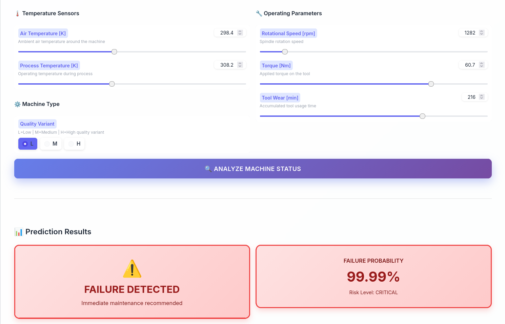
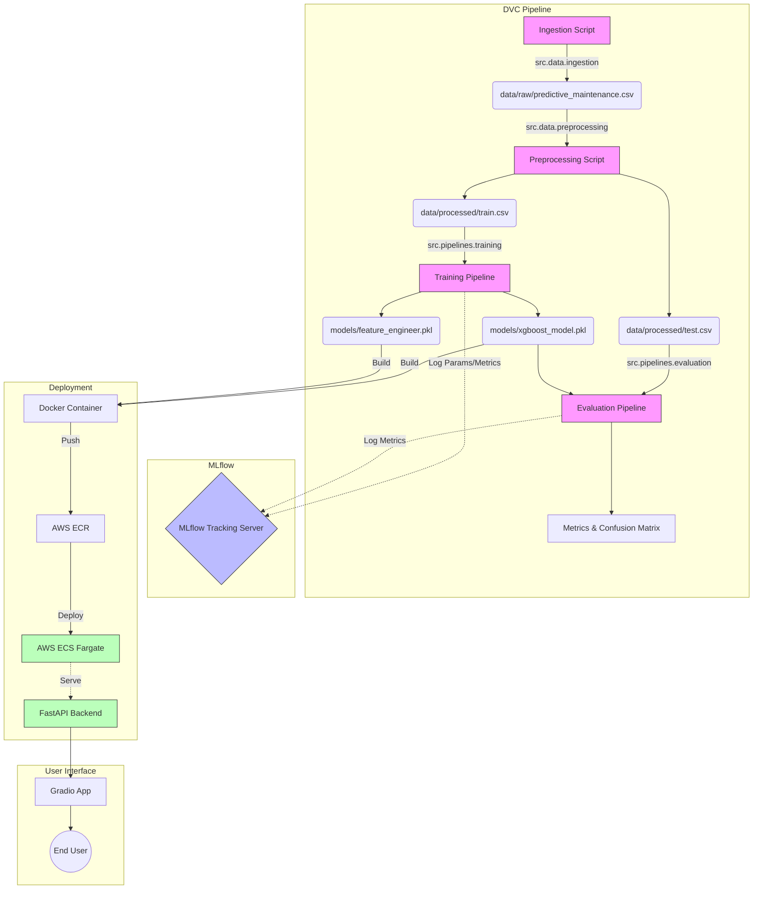

# 🏭 Predictive Maintenance AI 🧪 🚀

**Predictive Maintenance using XGBoost, tracked with MLflow, versioned with DVC, and deployed on AWS Fargate.**



## 🏗️ Architecture



## 🛠️ Tech Stack

-   **Experiment Tracking**: 
-   **Data Versioning**:  + **AWS S3**
-   **Modeling**:   
-   **API**: 
-   **Containerization**: 
-   **Cloud Ops**:  (ECR Registry, ECS Fargate Compute)
-   **App**: 

## 📂 Project Structure

```text
predictive-maintenance/
├── .dvc/                  # DVC configuration
├── .dvcignore
├── .github/
│   └── workflows/
│       └── deploy.yml     # CI/CD Pipeline
├── app/
│   └── gradio_app.py      # Frontend Application
├── api/                   # FastAPI Backend
├── assets/
│   └── app_screenshot.png
├── data/                  # Data directory (tracked by DVC)
├── docker/
│   ├── Dockerfile         # Container definition
│   └── task-definition.json
├── mlruns/                # MLflow tracking data
├── models/                # Saved models (tracked by DVC/MLflow)
├── notebooks/             # Jupyter notebooks for EDA and experiments
├── scripts/               # Utility scripts
├── src/                   # Source code
│   ├── data/
│   ├── features/
│   └── pipelines/
├── tests/                 # Unit and integration tests
├── dvc.yaml               # DVC pipeline definition
├── dvc.lock               # DVC lock file
└── requirements.txt       # Python dependencies
```

## ⚡ Installation & Usage

### 1. Setup Environment
```bash
# Clone the repo
git clone https://github.com/aymanz12/predictive-maintenance.git
cd predictive-maintenance

# Install dependencies
pip install -r requirements.txt
```

### 2. Fetch Data & Models
Pull the latest versioned data and model artifacts from AWS S3 using DVC.
```bash
dvc pull
```

### 3. Track Experiments
Launch the MLflow UI to view training runs and metrics.
```bash
mlflow ui
# Access at http://localhost:5000
```

### 4. Run the Application
Start the Gradio dashboard locally.
```bash
python app/gradio_app.py
# Access at http://localhost:7860
```

## ☁️ AWS Deployment Guide

This project is configured for continuous deployment. However, you can manually trigger the workflow steps:

1.  **Build Docker Image**
    ```bash
    docker build -t predictive-maintenance -f docker/Dockerfile .
    ```

2.  **Push to AWS ECR**
    ```bash
    # Login to ECR
    aws ecr get-login-password --region <region> | docker login --username AWS --password-stdin <aws_account_id>.dkr.ecr.<region>.amazonaws.com
    
    # Tag and Push
    docker tag predictive-maintenance:latest <aws_account_id>.dkr.ecr.<region>.amazonaws.com/predictive-maintenance:latest
    docker push <aws_account_id>.dkr.ecr.<region>.amazonaws.com/predictive-maintenance:latest
    ```

3.  **Update ECS Service**
    ```bash
    aws ecs update-service --cluster <cluster_name> --service <service_name> --force-new-deployment
    ```
